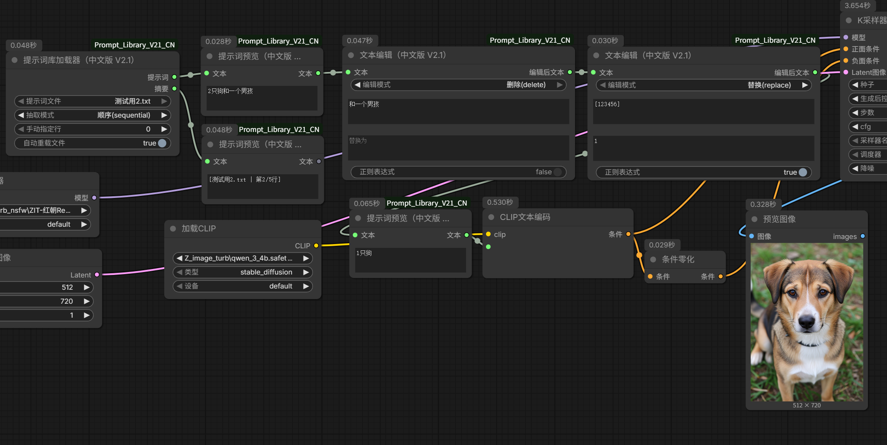

# ComfyUI Prompt Library

为 ComfyUI 设计的**提示词（Prompt）库管理 + 抽取 + 预览**自定义节点。适合管理大型提示词库，从文本文件中按需抽取提示词，并能直观看到输出的行号与内容。

## ✨ 特性

- 📁 **提示词库管理**：一个 `prompt_library` 文件夹装下所有 `.txt` 提示词库，支持子目录
- 🎯 **三种抽取模式**：
  - `random` 随机抽一条
  - `sequential` 顺序轮询
  - `neverrepeat` 洗牌不重复（抽完一轮自动重洗）
- 📌 **手动指定行号**：精确选第几行（越界自动回绕）
- 🏷️ **行号摘要**：输出 `[文件 | 第X/Y行]`，随时知道抽到哪一条
- 👁️ **自带文本预览节点**：节点上直接显示当前提示词内容
- 🔄 **自动重载**：修改 txt 文件后自动生效
- 🌏 **中/英双语**：提供英文版与中文界面版两个包

> **V2.1 新增**：在 V2 基础上叠加**单步文本编辑节点**（替换 / 前缀插入 / 后缀插入 / 删除，可选正则，可串联）。

## 📦 包含版本

| 目录 | 说明 |
|------|------|
| `ComfyUI_Prompt_Library_V2` | **英文版 V2**（原版，仅 Loader + Preview，节点界面为英文） |
| `ComfyUI_Prompt_Library_CN` | **中文版 V2**（原版，仅 Loader + Preview，节点界面为中文，含示例工作流） |
| `ComfyUI_Prompt_Library_V21` | **英文版 V2.1**（在原版基础上新增文本编辑节点） |
| `ComfyUI_Prompt_Library_V21_CN` | **中文版 V2.1**（在原版基础上新增文本编辑节点） |

**版本分层原则**：V2 与 CN 为**原版基线**，保持稳定、不再改动（除非修正 BUG）；新功能一律通过**新增版本**（如 V2.1）承载，迭代演进。各版本节点 `className` 互不相同，可同时安装共存。

## 🚀 安装

1. 将对应包目录克隆/拷贝到 ComfyUI 的 `custom_nodes/` 下，**目录名保持不变**：

   ```bash
   cd ComfyUI/custom_nodes/
   git clone https://github.com/你的用户名/ComfyUI-Prompt-Library.git
   # 或只安装中文版：
   # 复制 ComfyUI_Prompt_Library_CN 整个文件夹到 custom_nodes/
   ```

2. **重启 ComfyUI**（⚠️ 必须重启进程，前端 JS 才会加载，不是刷新浏览器）。

3. 在 ComfyUI 中搜索节点：
   - 中文版：搜索 **"提示词"**
   - 英文版：搜索 **"Prompt"** 或 **"Prompt Library"**

## 📖 使用

### 1. 准备提示词库

在 ComfyUI 根目录（`custom_nodes` 的上一级）创建 `prompt_library/` 文件夹，放入 `.txt` 提示词文件：

```
ComfyUI/
├── custom_nodes/
│   └── ComfyUI_Prompt_Library_CN/   # 本插件
└── prompt_library/                   # ← 提示词库（每行一条）
    ├── girl.txt
    ├── landscape.txt
    └── anime/
        ├── cute.txt
        └── realistic.txt
```

> **⚠️ V2 / V2.1 路径差异**：V2 / CN 版本读取的是 **ComfyUI 根目录**下的 `prompt_library/`；而 **V2.1 版本**读取的是**插件自身目录**下的 `prompt_library/`（即 `custom_nodes/ComfyUI_Prompt_Library_V21/prompt_library/`，目录不存在会自动创建）。两者互不干扰。

- 每行一条提示词
- `#` / `//` / `;` 开头的行视为注释，自动跳过
- 支持 UTF-8 / BOM 编码

### 2. 节点连线

```
[提示词库加载器] ──提示词──→ [提示词预览] [文本]
            └──摘要（显示 [文件 | 第X/Y行]）
```

- **提示词库加载器**：选文件、选模式、可选手动指定行号
- **提示词预览**：节点自带显示窗口，执行后直接看到当前提示词内容

### 3. 示例工作流

中文版包含一个可直接导入的 Z-image 文生图工作流：`ComfyUI_Prompt_Library_CN/ComfyUI_Prompt_Library_CN.json`



> 注：示例工作流依赖 Z-image 相关模型（UNET/CLIP/VAE），需自行准备对应模型文件。

## 🔧 输入参数说明（中文版）

| 参数 | 说明 |
|------|------|
| 提示词文件 | 选择库内的 `.txt` 文件 |
| 抽取模式 | 随机 / 顺序 / 不重复 |
| 手动指定行 | `0`=走模式自动；`>0`=固定选第几行（越界回绕） |
| 自动重载文件 | 修改文件后是否自动生效（勾选=自动，走缓存） |

## 🗂️ 目录结构

```
ComfyUI_Prompt_Library_V2|_CN/
├── __init__.py              # 节点注册 + WEB_DIRECTORY
├── nodes_*.py               # 核心节点（Loader + Preview）
├── scanner.py               # 扫描提示词库目录
├── state.py                 # 读取进度持久化
├── cache.py                 # 线程安全缓存
├── utils.py                 # 文件读取工具
└── web/
    └── prompt_library_*.js  # 前端预览渲染（关键）
```

## 📄 详细文档

完整节点参数、目录结构与开发说明见各包内的 `README.md`。

## 📝 License

MIT（待确认，如需正式开源协议可补充）
